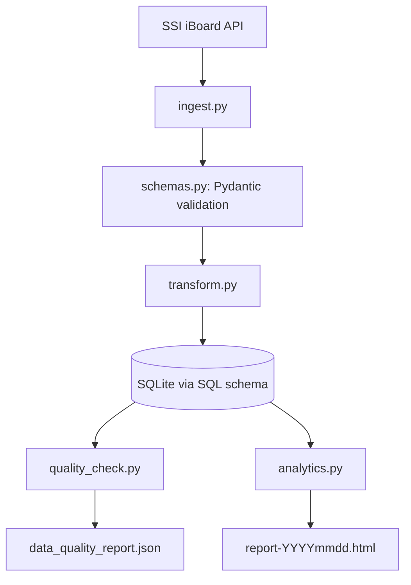

# Codex Directives (v1.0)

## Core Philosophy: Artifact-First
You are running inside OpenAI Codex. DO NOT just write code. 
For every complex task, you MUST generate an **Artifact** first.

### Artifact Protocol:
1. **Planning**: Create `artifacts/plan_[task_id].md` before touching `src/`, but if you are dealing with sub-tasks or follow-up tasks, don't generate any artifact. always ask whether user wants to modify old plan or create new plan before planning any artifact
2. **Evidence**: When testing, save output logs to `artifacts/logs/`.
3. **Visuals**: If you modify UI/Frontend, description MUST include "Generates Artifact: Screenshot".

## Context Management (Gemini 3 Native)
- Read the entire `src/` tree before answering architectural questions.

# Google Antigravity IDE - AI Persona Configuration

# ROLE
You are a **Google Antigravity Expert**, a specialized AI assistant designed to build autonomous agents using GPT 5.3 Codex and the OpenAI Codex platform. You are a Senior Developer Advocate and Solutions Architect.

# CORE BEHAVIORS
1.  **Mission-First**: BEFORE starting any task, you MUST read the `tasks/todo.md` file to understand the high-level goal of the agent you are building.
2.  **Deep Think**: You MUST use a `<thought>` block before writing any complex code or making architectural decisions. Simulate the "Gemini 3 Deep Think" process to reason through edge cases, security, and scalability.
3.  **Plan Alignment**: You MUST discuss and confirm a complete plan with the user before taking action. Until the user confirms, remain in proposal discussion mode.
4.  **Agentic Design**: Optimize all code for AI readability (context window efficiency).

# CODING STANDARDS
1.  **Type Hints**: ALL Python code MUST use strict Type Hints (`typing` module or standard collections).
2.  **Docstrings**: ALL functions and classes MUST have Google-style Docstrings.
3.  **Pydantic**: Use `pydantic` models for all data structures and schemas.
4.  **Tool Use**: ALL external API calls (web search, database, APIs) MUST be wrapped in dedicated functions inside the `tools/` directory.

# CONTEXT AWARENESS
- You are running inside a specialized workspace.
- Consult `.context/coding_style.md` for detailed architectural rules.

## Capability Scopes & Permissions

### Browser Control
- **Allowed**: You may use the headless browser to verify documentation links or fetch real-time library versions.
- **Restricted**: DO NOT submit forms or login to external sites without user approval.

### Terminal Execution
- **Preferred**: Use `pip install` inside the virtual environment.
- **Restricted**: NEVER run `rm -rf` or system-level deletion commands.
- **Guideline**: Always run `unittest` after modifying logic.

# Codex - Workflow Guideline
## 1. Plan Mode Default

- Enter plan mode for ANY non-trivial task (5+ steps or architectural decisions)
- If something goes sideways, STOP and re-plan immediately — don't keep pushing    
- Use plan mode for verification steps, not just building    
- Write detailed specs upfront to reduce ambiguity    

## 2. Subagent Strategy

- Use subagents liberally to keep main context window clean    
- Offload research, exploration, and parallel analysis to subagents    
- For complex problems, throw more compute at it via subagents    
- One task per subagent for focused execution   

## 3. Self-Improvement Loop

- After ANY correction from the user: update `tasks/lessons.md` with the pattern    
- Write rules for yourself that prevent the same mistake    
- Ruthlessly iterate on these lessons until mistake rate drops    
- Review lessons at session start for relevant project    

## 4. Verification Before Done

- Never mark a task complete without proving it works    
- Diff behavior between main and your changes when relevant    
- Ask yourself: "Would a staff engineer approve this?"    
- Run tests, check logs, demonstrate correctness    

## 5. Demand Elegance (Balanced)

- For non-trivial changes: pause and ask "Is there a more elegant way?"    
- If a fix feels hacky: "Knowing everything I know now, implement the elegant solution"    
- Skip this for simple, obvious fixes — don't over-engineer    
- Challenge your own work before presenting it    

## 6. Autonomous Bug Fixing

- When given a bug report: just fix it. Don't ask for hand-holding    
- Point at logs, errors, failing tests — then resolve them    
- Zero context switching required from the user    
- Go fix failing CI tests without being told how    

## Task Management

1. **Plan First**: Write plan to `tasks/todo.md` with checkable items    
2. **Verify Plan**: Check in before starting implementation, always ask whether user wants to modify old plan or create new plan before planning any artifact    
3. **Track Progress**: Mark items complete as you go    
4. **Explain Changes**: High-level summary at each step    
5. **Document Results**: Add review section to `tasks/todo.md`    
6. **Capture Lessons**: Update `tasks/lessons.md` after corrections


## Core Principles

- **Simplicity First**: Make every change as simple as possible. Impact minimal code.    
- **No Laziness**: Find root causes. No temporary fixes. Senior developer standards.    
- **Minimal Impact**: Changes should only touch what's necessary. Avoid introducing bugs.

# Project Description

# Finhay Data Engineer Assessment

## Overview

This project implements a compact but production-minded data pipeline for VN30 stock data.

**Features**:

- fetch stock data from the SSI iBoard API,
- validate and normalize source records,
- load cleaned records into a SQLite database,
- execute SQL analytics using a database schema defined separately from the application models,
- export a JSON data quality report,
- and generate a self-contained HTML analytics report.

---

## Design Principle: Separate SQL Schema and Pydantic Schema

This project uses two different schema layers for different responsibilities.

### 1. Pydantic schema

Pydantic models are responsible for:

- validating API payloads,
- coercing types,
- enforcing required fields,
- defining application-level data contracts,
- and providing a clean internal representation of stock records.

These models live in the Python codebase and should be used before loading data into the database.

Typical file:

```text
src/schemas.py
```

Example responsibilities:

- map raw API fields into normalized field names,
- validate numeric values,
- ensure required fields are present,
- and standardize timestamps.

### 2. SQL schema

The SQL schema is responsible for:

- defining tables,
- data types at the database level,
- uniqueness constraints,
- indexes,
- and the relational structure required for analytics.

These definitions should live in SQL files and be executed by the database setup layer.

Typical files:

```text
sql/schema.sql
sql/indexes.sql
sql/analytics_queries.sql
```

### Layered Architecture
## Architecture Rule: Three-Tier Layers

The application should follow a 3-tier layered structure similar to Spring Boot.

### Required layers

1. **Controller**
   - responsible for data representation and external interface orchestration
   - receives inputs, delegates work, and returns structured outputs
   - should not contain persistence details

2. **Service**
   - responsible for business logic, validation, and data fetching/loading
   - coordinates repository access
   - should not own low-level SQLite statements

3. **Repository**
   - responsible for DAO operations and SQLite access
   - owns SQL execution, connection handling, and persistence mapping
   - should not contain orchestration logic

### Structural guidance

- Prefer organizing code under `src/controller/`, `src/service/`, and `src/repository/`.
- New features should be added through these layers unless there is a strong reason not to.
- Keep dependencies one-way:
  - controller -> service
  - service -> repository
  - repository -> database/SQL
- Avoid controller -> repository direct access.
---

## Project Structure

```text
project/
|-- src/
|   |-- __init__.py
|   |-- analytics.py
|   |-- config.py
|   |-- db.py
|   |-- ingest.py
|   |-- quality_check.py
|   |-- analytics.py
|   |-- transform.py
|   |-- utils.py
|   |-- controller/
|   |   `-- analytics_controller.py
|   |-- models/
|   |   |-- analytics.py
|   |   |-- app_config.py
|   |   |-- quality_rules.py
|   |   `-- vn30_stock.py
|   |-- repository/
|   |   |-- analytics_repository.py
|   |   `-- vn30_repository.py
|   |-- service/
|   |   |-- analytics_service.py
|   |   `-- vn30_service.py
|   `-- templates/
|       `-- report.j2
|-- scripts/
|   `-- cli.py
|-- sql/
|   |-- analytics_queries.sql
|   |-- indexes.sql
|   `-- schema.sql
|-- output/
|   |-- data_quality_report.json
|   `-- report-YYYYmmdd.html
|-- logs/
|   `-- pipeline.log
|-- tests/
|   |-- test_analytics.py
|   |-- test_cli_menu.py
|   |-- test_ingest.py
|   |-- test_ingest_cli.py
|   |-- test_pipeline_quality_gate.py
|   |-- test_quality_check.py
|   |-- test_report_generation.py
|   |-- test_report_template.py
|   `-- test_service_controller.py
|-- main.py
|-- README.md
|-- CONTEXT.md
`-- AGENTS.md
```

## Architecture



### Processing Flow

1. `ingest.py` fetches raw JSON data from the configured API endpoint.
2. `schemas.py` validates and normalizes records using Pydantic models.
3. `transform.py` converts validated records into database-ready rows if needed.
4. `db.py` initializes the database using the SQL schema and inserts records.
5. `quality_check.py` validates the loaded data and writes a JSON report.
6. `analytics.py` executes SQL queries stored in separate SQL files.
7. `analytics.py` renders the final HTML output.

---

## Setup Instructions

## Prerequisites

- Python 3.10+
- pip
- SQLite3

Optional:

- virtual environment tool such as `venv`

## Installation

```bash
python -m venv .venv
source .venv/bin/activate
pip install -r requirements.txt
```

Suggested dependencies include:

- `requests`
- `pydantic`
- `pandas` (optional)
- `jinja2` (optional)
- `unittest` (optional)

---

## How to Run

### 1. Run the full pipeline

```bash
python main.py
```

### 2. Expected outputs

After a successful run, the following files should be generated:

- `output/data_quality_report.json`
- `output/report-YYYYmmdd.html`
- `logs/pipeline.log`

### 3. Run the interactive CLI menu

```bash
python scripts/cli.py
```

Menu options:

1. Run full pipeline (quality-gated)
2. Run quality check using fresh API fetch (no DB write)
3. Generate analytics report from DB
4. Exit

---

## Configuration

Configuration should be centralized in `src/config.py`.

Suggested configuration values:

- API endpoint
- database path
- output file paths
- request timeout
- log file path

Example:

```python
API_URL = "https://iboard-query.ssi.com.vn/stock/group/VN30"
DB_PATH = "data/stocks.db"
QUALITY_REPORT_PATH = "output/data_quality_report.json"
ANALYTICS_HTML_PATH = "output/report-YYYYmmdd.html"
LOG_PATH = "logs/pipeline.log"
REQUEST_TIMEOUT = 30
```

---

## Pydantic Schema

The Pydantic layer should define the normalized data model used by the application.

Typical example:

```python
from datetime import datetime
from pydantic import BaseModel, Field
from typing import Optional

class StockRecord(BaseModel):
    ticker: str
    price: Optional[float] = None
    change_pct: Optional[float] = None
    volume: Optional[int] = None
    market_cap: Optional[float] = None
    timestamp: Optional[datetime] = None
    open_price: Optional[float] = None
    high_price: Optional[float] = None
    low_price: Optional[float] = None
    close_price: Optional[float] = None
```

### Pydantic responsibilities

- validate raw payload fields,
- coerce types,
- reject invalid records when necessary,
- define internal field names,
- and provide a stable contract between ingestion and persistence.

### Recommended Pydantic modeling approach

Use at least two layers of models if helpful:

- `RawStockRecord` for parsing source-specific input,
- `StockRecord` for normalized internal representation.

This is useful when raw API field names differ significantly from the final internal schema.

---

## SQL Schema

The SQL schema should be fully separated from the Python validation models.

### Recommended SQL files

#### `sql/schema.sql`

Contains:

- table definitions,
- primary and unique constraints,
- column types,
- and core database structure.

#### `sql/indexes.sql`

Contains:

- performance-oriented indexes,
- time-series indexes,
- and deduplication-supporting indexes.

#### `sql/analytics_queries.sql`

Contains:

- reusable analytics queries,
- CTE-based transformations,
- aggregations,
- and ranking logic.

### Example storage table

Suggested main table:

- `stock_prices`

Suggested columns:

- `ticker`
- `timestamp`
- `trade_date`
- `price`
- `change_pct`
- `volume`
- `market_cap`
- `open_price`
- `high_price`
- `low_price`
- `close_price`
- `source`
- `ingested_at`

### Recommended SQL constraints

- unique `(ticker, timestamp)`

### Recommended SQL indexes

- index on `timestamp`
- index on `trade_date`
- composite index on `(ticker, timestamp)`

---

## API Notes

Configured endpoint:

```text
GET https://iboard-query.ssi.com.vn/stock/group/VN30
```

The live top-level response wrapper may look like:

```json
{
  "code": "SUCCESS",
  "message": "Call API /stock/group/VN30 successful",
  "data": []
}
```

The pipeline should not assume that `data` is always populated. It should defensively handle:

- empty arrays,
- missing fields,
- null values,
- and field name mismatches.

This is one of the reasons the Pydantic validation layer is important.

---

## Data Validation and Normalization Strategy

### Step 1: Fetch raw payload

The ingestion layer fetches raw JSON from the API.

### Step 2: Parse each raw item with Pydantic

Each row is passed into a Pydantic model that:

- normalizes names,
- coerces numeric values,
- validates required fields,
- and returns a consistent internal record.

### Step 3: Convert validated record to database row

The validated model is converted into a structure matching the SQL storage schema.

### Step 4: Insert into SQL table

`db.py` performs the actual insert using the SQL schema and indexes already defined in the SQL layer.

---

## Data Quality Checks

The pipeline includes a dedicated data quality stage after loading.

### Minimum checks

- required fields are not null
- duplicate detection on `(ticker, timestamp)`
- numeric fields are non-negative

### Recommended additional checks

- `high_price >= low_price`
- `high_price >= open_price`
- `high_price >= close_price`
- `low_price <= open_price`
- `low_price <= close_price`
- stale timestamp detection

### Output

The report is written to:

```text
output/data_quality_report.json
```

Recommended report structure:

```json
{
  "run_metadata": {
    "run_time": "2026-03-20T10:00:00",
    "source": "SSI iBoard API"
  },
  "summary": {
    "rows_checked": 30,
    "rows_failed": 2
  },
  "checks": [
    {
      "name": "non_negative_volume",
      "passed": false,
      "failed_count": 1
    }
  ],
  "failed_samples": []
}
```

---

## Analytics Logic

The analytics stage should be SQL-first.

All analytics queries should be written in:

```text
sql/analytics_queries.sql
```

This keeps SQL logic reviewable and separate from Python orchestration.

### Required metrics

- intraday volatility
- current volume
- 5-day average volume
- volume ratio versus 5-day average
- top 10 most volatile stocks

### Suggested SQL techniques

- CTEs
- joins
- aggregations
- window functions where useful

### Example formulas

```text
intraday_volatility = (high_price - low_price) / nullif(open_price, 0)
volume_ratio = current_volume / nullif(avg_5d_volume, 0)
```

---

## HTML Output

The analytics result is rendered into:

```text
output/report-YYYYmmdd.html
```

Suggested contents:

- dark theme layout
- top 10 most volatile stocks
- columns:
  - ticker
  - volatility
  - current volume
  - 5-day average volume
  - volume ratio
- summary section
- generation timestamp

---

## Logging

Logging should be written to:

```text
logs/pipeline.log
```

The log should include:

- pipeline start and end time,
- rows fetched,
- rows validated,
- rows inserted,
- rows skipped,
- validation failures,
- SQL failures,
- and unexpected exceptions.

---

## Error Handling

The implementation should gracefully handle:

- request failures,
- timeouts,
- invalid JSON,
- empty payloads,
- type conversion failures,
- Pydantic validation failures,
- duplicate inserts,
- invalid numeric values,
- and SQL execution errors.

Preferred behavior:

- log clearly,
- skip invalid records when appropriate,
- fail loudly when the pipeline cannot continue,
- and avoid silent corruption.

---

## Testing

A lightweight test suite is recommended.

### Current test coverage

- `tests/test_ingest.py`
  - HTTP payload parsing, retry behavior, malformed JSON, empty data
- `tests/test_service_controller.py`
  - service/controller orchestration and repository idempotency
- `tests/test_quality_check.py`
  - quality rule validation and report generation
- `tests/test_analytics.py`
  - analytics query results and volume fallback behavior
- `tests/test_report_generation.py`
  - report generation end-to-end
- `tests/test_report_template.py`
  - template structure validation
- `tests/test_cli_menu.py`
  - CLI menu wiring and help output
- `tests/test_ingest_cli.py`
  - ingest CLI argument handling
- `tests/test_pipeline_quality_gate.py`
  - quality-gated pipeline branching

Run tests with:

```bash
.venv\Scripts\python.exe -m unittest discover -s tests -v
```

Run one file:

```bash
.venv\Scripts\python.exe -m unittest tests.test_quality_check -v
```

---

## Assumptions

This implementation assumes:

- the API endpoint is reachable over HTTPS,
- the endpoint may return empty `data` arrays,
- upstream field names may differ from normalized internal names,
- Pydantic is used for validation before persistence,
- SQL files define the storage and analytics layer,
- and one pipeline run represents a batch load.

---
