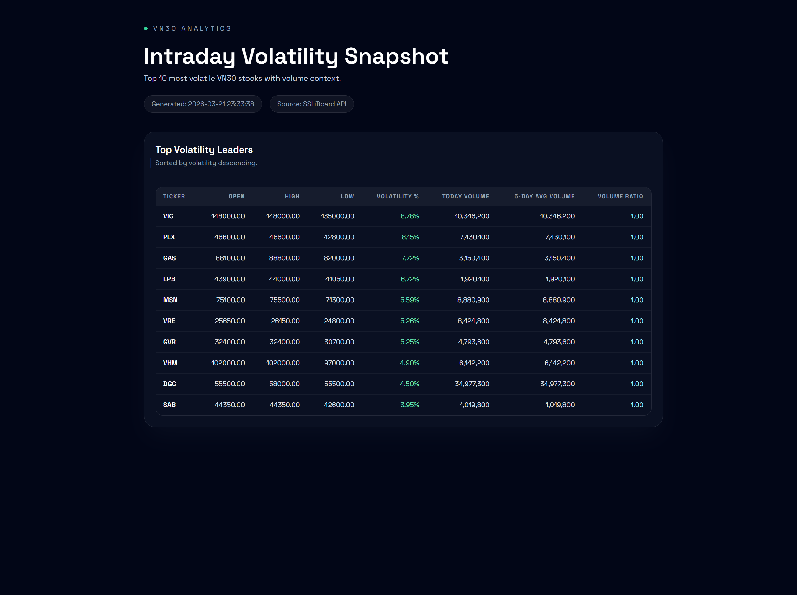

# Finhay Data Engineer Assessment

## Overview

This project implements a compact data pipeline for VN30 stock data.

**Features**:

- fetch stock data from the SSI iBoard API,
- validate and normalize source records,
- load cleaned records into a SQLite database,
- execute SQL analytics using a database schema defined separately from the application models,
- export a JSON data quality report,
- and generate a  HTML analytics report.

---

## Setup Instructions

## Prerequisites

- Python 3.10+
- uv
- SQLite3

Optional:

- virtual environment tool such as `venv`

## Installation

```bash
python -m venv .venv
source .venv/bin/activate
uv sync
```

Copy the environment template:

```bash
cp .env.template .env.local
```

```powershell
Copy-Item .env.template .env.local
```

Example `.env` file:

```bash
BASE_URL=https://iboard-query.ssi.com.vn/stock/group/VN30
DB_PATH=data/stocks.db
SCHEMA_PATH=sql/schema.sql
LOG_PATH=logs/pipeline.log
QUALITY_REPORT_PATH=logs/
ANALYTICS_SQL_PATH=sql/analytics_queries.sql
REPORT_TEMPLATE_PATH=src/templates/report.j2
REPORT_OUTPUT_DIR=output
REQUEST_TIMEOUT_SECONDS=30.0
MAX_RETRIES=3
RETRY_COOLDOWN_SECONDS=2.0
```

Populate the database: Create a SQLite file under `data` directory (default: `data/stocks.db`)

---

## Quick start

### 1. Configuration

Configuration should be centralized in `.env`.

Suggested configuration values:

- API endpoint
- database path
- output file paths
- request timeout/retries
- log file path

Example:

```bash
BASE_URL=https://iboard-query.ssi.com.vn/stock/group/VN30
DB_PATH=data/stocks.db
SCHEMA_PATH=sql/schema.sql
LOG_PATH=logs/pipeline.log
QUALITY_REPORT_PATH=logs/
ANALYTICS_SQL_PATH=sql/analytics_queries.sql
REPORT_TEMPLATE_PATH=src/templates/report.j2
REPORT_OUTPUT_DIR=output
REQUEST_TIMEOUT_SECONDS=30.0
MAX_RETRIES=3
RETRY_COOLDOWN_SECONDS=2.0
```

### 2. Run the full pipeline

```bash
python main.py
```

Select option `1` in the menu to run the full pipeline.
After a successful run, the following files should be generated:

- `output/qac_YYYY-MM-dd.json`

```json
{
  "run_metadata": {
    "run_id": "2026-03-22T11:14:21.175453+07:00",
    "source": "https://iboard-query.ssi.com.vn/stock/group/VN30",
    "dataset": "VN30",
    "generated_at": "2026-03-22T11:14:21.175453+07:00",
    "trading_timezone": "Asia/Ho_Chi_Minh",
    "records_checked": 1
  },
  "summary": {
    "total_rules": 12,
    "passed_rules": 12,
    "failed_rules": 0,
    "overall_status": "pass"
  },
  "checks": [
    {
      "rule_name": "No NULL prices",
      "rule_code": "no_null_prices",
      "description": "Every record must have a non-null price.",
      "logic": "price IS NOT NULL",
      "status": "pass",
      "violation_count": 0,
      "affected_tickers": [],
      "sample_violations": []
    },
    {
      "rule_name": "Price change within bounds",
      "rule_code": "price_change_within_bounds",
      "description": "change_pct must be within +/-30%.",
      "logic": "-30 <= change_pct <= 30",
      "status": "pass",
      "violation_count": 0,
      "affected_tickers": [],
      "sample_violations": []
    }
    ...
  ]
}
```

- `output/report-YYYYmmdd.html`
  
- `logs/pipeline.log`

To execute each features manually, please refer to [CLI Manuals](./docs/CLI_MANUALS.md)

## Project Structure

```text
├── .agent/                     # Local workspace metadata or agent-related helper files used during development
├── .venv/                      # Python virtual environment with installed dependencies for local execution
├── artifacts/                  # Generated auxiliary artifacts, intermediate exports, or supporting deliverables
├── data/                       # Local data storage such as SQLite database files, cached raw payloads, or sample datasets
├── dist/                       # Build or packaged distribution outputs generated for release or sharing
├── logs/                       # Runtime logs, quality check logs, and execution traces for debugging and monitoring
├── output/                     # Final pipeline deliverables such as HTML reports, JSON quality reports, and CSV exports
├── scripts/                    # Utility scripts for setup, maintenance, local automation, or one-off execution tasks
├── sql/                        # SQL assets including schema definitions, indexes, validation queries, and analytics queries
├── src/                        # Main application source code for the data pipeline
│   ├── __pycache__/            # Python bytecode cache generated automatically during local execution
│   ├── controller/             # High-level orchestration layer coordinating pipeline steps or execution flows
│   ├── models/                 # Data models such as Pydantic schemas, report models, and normalized record definitions
│   ├── repository/             # Data access layer responsible for SQL execution, database interactions, and persistence
│   ├── service/                # Core business logic for ingestion, transformation, validation, analytics, and reporting
│   ├── templates/              # HTML or text templates used to render analytics reports and outputs
│   ├── __init__.py             # Marks src as a Python package
│   ├── analytics.py            # Analytics logic for SQL-driven metrics, ranking, and report-ready result generation
│   ├── config.py               # Centralized configuration management for paths, API settings, and runtime options
│   ├── db.py                   # Database initialization, connection handling, schema setup, and low-level DB utilities
│   ├── ingest.py               # API ingestion pipeline for fetching, parsing, and loading upstream market data
│   ├── quality_check.py        # Data quality validation logic and generation of structured quality reports
│   └── utils.py                # Shared helper functions such as logging, time handling, formatting, and common utilities
├── tasks/                      # Personal project management notes, checklists, lessons learned, and execution planning
│   ├── lessons.md              # Notes on implementation learnings, issues encountered, and useful observations
│   └── todo.md                 # Task backlog, implementation checklist, or remaining work items
├── tests/                      # Automated tests including unit tests and potentially integration or smoke tests
├── .env.local                  # Local environment variable values for development, not intended for public sharing
├── .env.template               # Template of required environment variables for setup and reproducible configuration
├── .gitignore                  # Git ignore rules excluding virtual environments, caches, outputs, and sensitive local files
├── .python-version             # Python version pinning for local tooling or environment managers
├── AGENTS.md                   # Internal instructions, conventions, or notes for AI-assisted or structured development workflows
├── CONTEXT.md                  # Project context, assumptions, design notes, and implementation references
├── main.py                     # Main entrypoint to run the end-to-end pipeline or selected execution flow
├── pyproject.toml              # Python project configuration, dependency definitions, and tool settings
├── README.md                   # Main project documentation covering setup, architecture, usage, and design decisions
└── uv.lock                     # Locked dependency file for reproducible installs when using uv
```

---

## Schemas and Validation

Schema definitions, API payload notes, and data validation rules now live in
[Schemas](./docs/SCHEMAS.md).

---

## Analytics and Logging

Analytics logic, HTML report notes, and logging details now live in
[Analytics and Logging](./docs/ANALYTICS_LOGGING.md).

---

## Testing

Refer to  [CLI Manuals](./docs/CLI_MANUALS.md) for more information to execute tests.

---

## Planned Extensions

Refer to [Future Works](./docs/FUTURE_WORKS.md)
