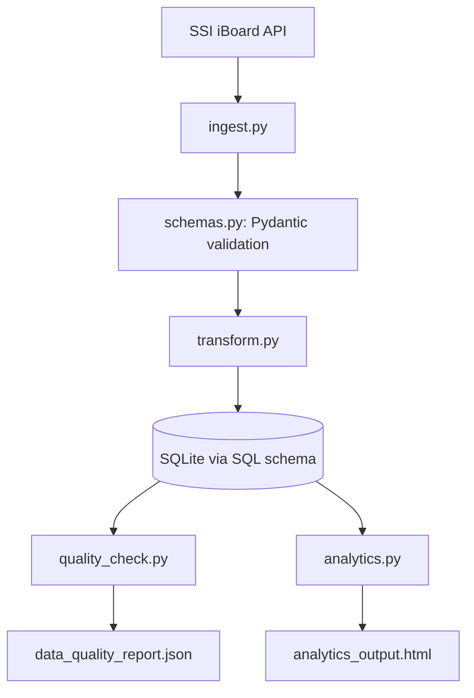

# Finhay Data Engineer Assessment

## Overview

This project implements a compact but production-minded data pipeline for HOSE30 stock data.

**Features**:

- fetch stock data from the SSI iBoard API,
- validate and normalize source records,
- load cleaned records into a SQLite database,
- execute SQL analytics using a database schema defined separately from the application models,
- export a JSON data quality report,
- and generate a self-contained HTML analytics report.

---

## Design Principle: Separate SQL Schema and Pydantic Schema

This project uses two different schema layers for different responsibilities.

### 1. Pydantic schema

Pydantic models are responsible for:

- validating API payloads,
- coercing types,
- enforcing required fields,
- defining application-level data contracts,
- and providing a clean internal representation of stock records.

These models live in the Python codebase and should be used before loading data into the database.

Typical file:

```text
src/schemas.py
```

Example responsibilities:

- map raw API fields into normalized field names,
- validate numeric values,
- ensure required fields are present,
- and standardize timestamps.

### 2. SQL schema

The SQL schema is responsible for:

- defining tables,
- data types at the database level,
- uniqueness constraints,
- indexes,
- and the relational structure required for analytics.

These definitions should live in SQL files and be executed by the database setup layer.

Typical files:

```text
sql/schema.sql
sql/indexes.sql
sql/analytics_queries.sql
```

---

## Project Structure

```text
project/
├── src/
│   ├── config.py
│   ├── db.py
│   ├── ingest.py
│   ├── transform.py
│   ├── quality_check.py
│   ├── analytics.py
│   ├── report.py
│   ├── schemas.py
│   └── utils.py
├── sql/
│   ├── schema.sql
│   ├── indexes.sql
│   └── analytics_queries.sql
├── output/
│   ├── data_quality_report.json
│   └── analytics_output.html
├── logs/
│   └── pipeline.log
├── tests/
│   ├── test_transform.py
│   ├── test_quality.py
│   ├── test_analytics.py
│   └── test_schemas.py
├── main.py
└── README.md
```

---

## Architecture



### Processing Flow

1. `ingest.py` fetches raw JSON data from the configured API endpoint.
2. `schemas.py` validates and normalizes records using Pydantic models.
3. `transform.py` converts validated records into database-ready rows if needed.
4. `db.py` initializes the database using the SQL schema and inserts records.
5. `quality_check.py` validates the loaded data and writes a JSON report.
6. `analytics.py` executes SQL queries stored in separate SQL files.
7. `report.py` renders the final HTML output.

---

## Setup Instructions

## Prerequisites

- Python 3.10+
- pip
- SQLite3

Optional:

- virtual environment tool such as `venv`

## Installation

```bash
python -m venv .venv
source .venv/bin/activate
pip install -r requirements.txt
```

Suggested dependencies include:

- `requests`
- `pydantic`
- `pandas` (optional)
- `jinja2` (optional)
- `pytest` (optional)

---

## How to Run

### 1. Run the full pipeline

```bash
python main.py
```

### 2. Expected outputs

After a successful run, the following files should be generated:

- `output/data_quality_report.json`
- `output/analytics_output.html`
- `logs/pipeline.log`

---

## Configuration

Configuration should be centralized in `src/config.py`.

Suggested configuration values:

- API endpoint
- database path
- output file paths
- request timeout
- log file path

Example:

```python
API_URL = "https://iboard-query.ssi.com.vn/stock/group/HOSE30"
DB_PATH = "data/stocks.db"
QUALITY_REPORT_PATH = "output/data_quality_report.json"
ANALYTICS_HTML_PATH = "output/analytics_output.html"
LOG_PATH = "logs/pipeline.log"
REQUEST_TIMEOUT = 30
```

---

## Pydantic Schema

The Pydantic layer should define the normalized data model used by the application.

Typical example:

```python
from datetime import datetime
from pydantic import BaseModel, Field
from typing import Optional

class StockRecord(BaseModel):
    ticker: str
    price: Optional[float] = None
    change_pct: Optional[float] = None
    volume: Optional[int] = None
    market_cap: Optional[float] = None
    timestamp: Optional[datetime] = None
    open_price: Optional[float] = None
    high_price: Optional[float] = None
    low_price: Optional[float] = None
    close_price: Optional[float] = None
```

### Pydantic responsibilities

- validate raw payload fields,
- coerce types,
- reject invalid records when necessary,
- define internal field names,
- and provide a stable contract between ingestion and persistence.

### Recommended Pydantic modeling approach

Use at least two layers of models if helpful:

- `RawStockRecord` for parsing source-specific input,
- `StockRecord` for normalized internal representation.

This is useful when raw API field names differ significantly from the final internal schema.

---

## SQL Schema

The SQL schema should be fully separated from the Python validation models.

### Recommended SQL files

#### `sql/schema.sql`

Contains:

- table definitions,
- primary and unique constraints,
- column types,
- and core database structure.

#### `sql/indexes.sql`

Contains:

- performance-oriented indexes,
- time-series indexes,
- and deduplication-supporting indexes.

#### `sql/analytics_queries.sql`

Contains:

- reusable analytics queries,
- CTE-based transformations,
- aggregations,
- and ranking logic.

### Example storage table

Suggested main table:

- `stock_prices`

Suggested columns:

- `ticker`
- `timestamp`
- `trade_date`
- `price`
- `change_pct`
- `volume`
- `market_cap`
- `open_price`
- `high_price`
- `low_price`
- `close_price`
- `source`
- `ingested_at`

### Recommended SQL constraints

- unique `(ticker, timestamp)`

### Recommended SQL indexes

- index on `timestamp`
- index on `trade_date`
- composite index on `(ticker, timestamp)`

---

## API Notes

Configured endpoint:

```text
GET https://iboard-query.ssi.com.vn/stock/group/HOSE30
```

The live top-level response wrapper may look like:

```json
{
  "code": "SUCCESS",
  "message": "Call API /stock/group/HOSE30 successful",
  "data": []
}
```

The pipeline should not assume that `data` is always populated. It should defensively handle:

- empty arrays,
- missing fields,
- null values,
- and field name mismatches.

This is one of the reasons the Pydantic validation layer is important.

---

## Data Validation and Normalization Strategy

### Step 1: Fetch raw payload

The ingestion layer fetches raw JSON from the API.

### Step 2: Parse each raw item with Pydantic

Each row is passed into a Pydantic model that:

- normalizes names,
- coerces numeric values,
- validates required fields,
- and returns a consistent internal record.

### Step 3: Convert validated record to database row

The validated model is converted into a structure matching the SQL storage schema.

### Step 4: Insert into SQL table

`db.py` performs the actual insert using the SQL schema and indexes already defined in the SQL layer.

---

## Data Quality Checks

The pipeline includes a dedicated data quality stage after loading.

### Minimum checks

- required fields are not null
- duplicate detection on `(ticker, timestamp)`
- numeric fields are non-negative

### Recommended additional checks

- `high_price >= low_price`
- `high_price >= open_price`
- `high_price >= close_price`
- `low_price <= open_price`
- `low_price <= close_price`
- stale timestamp detection

### Output

The report is written to:

```text
output/data_quality_report.json
```

Recommended report structure:

```json
{
  "run_metadata": {
    "run_time": "2026-03-20T10:00:00",
    "source": "SSI iBoard API"
  },
  "summary": {
    "rows_checked": 30,
    "rows_failed": 2
  },
  "checks": [
    {
      "name": "non_negative_volume",
      "passed": false,
      "failed_count": 1
    }
  ],
  "failed_samples": []
}
```

---

## Analytics Logic

The analytics stage should be SQL-first.

All analytics queries should be written in:

```text
sql/analytics_queries.sql
```

This keeps SQL logic reviewable and separate from Python orchestration.

### Required metrics

- intraday volatility
- current volume
- 5-day average volume
- volume ratio versus 5-day average
- top 10 most volatile stocks

### Suggested SQL techniques

- CTEs
- joins
- aggregations
- window functions where useful

### Example formulas

```text
intraday_volatility = (high_price - low_price) / nullif(open_price, 0)
volume_ratio = current_volume / nullif(avg_5d_volume, 0)
```

---

## HTML Output

The analytics result is rendered into:

```text
output/analytics_output.html
```

Suggested contents:

- dark theme layout
- top 10 most volatile stocks
- columns:
  - ticker
  - volatility
  - current volume
  - 5-day average volume
  - volume ratio
- summary section
- generation timestamp

---

## Logging

Logging should be written to:

```text
logs/pipeline.log
```

The log should include:

- pipeline start and end time,
- rows fetched,
- rows validated,
- rows inserted,
- rows skipped,
- validation failures,
- SQL failures,
- and unexpected exceptions.

---

## Error Handling

The implementation should gracefully handle:

- request failures,
- timeouts,
- invalid JSON,
- empty payloads,
- type conversion failures,
- Pydantic validation failures,
- duplicate inserts,
- invalid numeric values,
- and SQL execution errors.

Preferred behavior:

- log clearly,
- skip invalid records when appropriate,
- fail loudly when the pipeline cannot continue,
- and avoid silent corruption.

---

## Testing

A lightweight test suite is recommended.

### Suggested tests

- Pydantic schema validation on valid and invalid payloads
- transformation from normalized model to DB row
- duplicate detection logic
- OHLC validation logic
- analytics query returns expected columns

Example test files:

- `tests/test_schemas.py`
- `tests/test_transform.py`
- `tests/test_quality.py`
- `tests/test_analytics.py`

Run tests with:

```bash
pytest
```

---

## Assumptions

This implementation assumes:

- the API endpoint is reachable over HTTPS,
- the endpoint may return empty `data` arrays,
- upstream field names may differ from normalized internal names,
- Pydantic is used for validation before persistence,
- SQL files define the storage and analytics layer,
- and one pipeline run represents a batch load.

---

## Limitations

Current MVP limitations:

- SQLite is not intended for high-concurrency production workloads
- no Airflow scheduling yet
- no dbt layer yet
- no Docker packaging by default
- no BI integration yet
- no streaming ingestion yet

These are deliberate trade-offs for a clean and fast MVP.

---

## Planned Extensions

### Airflow

Add orchestration for:

- fetch task
- validate task
- load task
- quality task
- analytics task
- publish task

### dbt

A later dbt version would be a good fit once the project moves to PostgreSQL or a warehouse.

In that version:

- Python handles API ingestion,
- raw/staging tables are loaded,
- dbt manages transformations and tests,
- and analytics marts feed dashboards.

### PostgreSQL

Replace SQLite with PostgreSQL for stronger concurrency, more realistic production behavior, and better integration with BI tools.

### Docker

Add containerized execution for reproducibility and deployment simplicity.

### CI/CD

Add GitHub Actions or similar pipelines for:

- linting,
- tests,
- packaging,
- and deployment checks.

---

## Discussion Points for Interview

### Why separate Pydantic and SQL schema

Because they solve different problems:

- Pydantic protects the application from bad external data.
- SQL schema defines how clean data is persisted and queried efficiently.

### Why SQL queries stay in `.sql` files

This makes the analytics logic:

- easier to review,
- easier to test,
- easier to optimize,
- and more aligned with data engineering workflows.

### Why this is still extensible

The current structure can evolve cleanly into:

- Airflow for orchestration,
- dbt for transformation modeling,
- PostgreSQL for production storage,
- and BI tooling for reporting.

---

## Submission Notes

The goal of this project is to demonstrate:

- Python ability,
- SQL capability,
- relational database thinking,
- API integration,
- schema design,
- data validation discipline,
- and a modular, extensible data pipeline architecture.

The separation between **Pydantic schema** and **SQL schema** is intentional and is a core design decision in this implementation.
